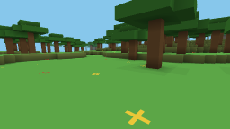

# Qwencraft

Repository: <https://github.com/cjdell/qwencraft>

**Live demo:** <https://qwencraft.home.chrisdell.info> · **Server dashboard:**
<https://qwencraft.home.chrisdell.info/dashboard/> — both hosted on an Intel
N100 mini-PC.

*Unapologetically vibe-coded with Qwen 3.8 on a single Radeon AI Pro R9700
32GB, in under 24 hours.*

A voxel (Minecraft-style) engine written in Rust that runs in the browser.
The world is generated procedurally from a seed, streamed on demand from an
embedded server crate, and rendered with WebGPU: procedurally-textured blocks
(every texture is a WGSL shader function — no image files), per-vertex voxel
lighting, ambient occlusion and distance fog, agents drawn as spheres,
first-person keyboard + mouse controls, and a hotbar for choosing what to
build with.

The landscape includes lakes and shorelines (translucent water you can
swim through), procedural trees with trunks and canopies, sandy beaches,
snow-capped peaks, caves, and flowers scattered on the grassland.



*Real rendered output, 256x144, read back from the GPU during
`./scripts/verify.sh` (the WebGL2 shadow renderer, see below).*

## Quick start

Everything runs through the Nix dev shell (Rust, wasm-bindgen 0.2.100,
chromium, python3, lavapipe):

```sh
nix develop --command bash -c './scripts/build.sh && ./scripts/verify.sh'
```

or, interactively:

```sh
nix develop
./scripts/build.sh     # wasm build -> web/dist
./scripts/serve.sh     # serve on http://localhost:8080
./scripts/serve.sh --https  # HTTPS (self-signed cert) — needed off-localhost
./scripts/verify.sh    # headless-chromium smoke test + pixel checks
./scripts/walk_test.sh # headless walk stress test (terrain pool / streaming)
./scripts/npc_test.sh  # headless NPC load test (physics on cached surfaces)
./scripts/secure_context_test.sh  # secure-context / HTTPS regression test
./scripts/remote_test.sh          # headless-server + browser end-to-end test
./scripts/touch_test.sh           # mobile touch-controls end-to-end test
./scripts/wan_resync_test.sh      # deterministic transit-loss test (resync repair)
./scripts/dashboard_test.sh       # server dashboard end-to-end test
cargo test             # host unit tests (worldgen, physics, streaming, …)

# headless server (separate process, one shared world for all connections):
cargo run -p qwencraft-net --release -- --seed 1337 --port 9000
# then open http://localhost:8080/?server=ws://localhost:9000/ws
# — or type the ws:// URL into the start screen's Options panel.
# Every browser that connects joins the SAME world: players see each other
# (spheres with name tags, using the name + colour from Options) and one
# player's block edits appear in everyone else's world.
# The server listens on ONE port only: the WebSocket lives at /ws on it,
# the dashboard under /dashboard, and it even serves the game page itself
# at / (so the server can host the whole experience by itself).
```

> **Headless server.** `qwencraft-net` runs the authoritative game server
> standalone (tokio, WebSocket). All connections share *one* world (one
> `Server` for the configured seed), ticked at a fixed 60 Hz on the server;
> the browser only renders and forwards input. Open two browsers at the same
> URL to play together — each sees the others (as named, coloured spheres)
> and their edits. `?server=` (or the start screen's **Options** panel) points
> the client at it; without it, the embedded in-browser server is used
> exactly as before. See [Headless server](#headless-server-remote-play).

> **Playing from another device on your network:** browsers only enable
> WebGPU in *secure contexts* (`https://` or `localhost`), so
> `http://192.168.x.x:8080` won't work. Run `./scripts/serve.sh --https`
> (generates a self-signed cert in `.certs/` once) and open
> `https://<machine-LAN-IP>:8080` on the other device, accepting the
> browser's certificate warning. The app detects the missing WebGPU on
> plain HTTP and shows an explanatory message instead of crashing. Phones
> and tablets get the two-thumb touch controls automatically (see
> [Mobile (touch controls)](#mobile-touch-controls)).

## Start screen & options

The start screen shows one big instruction — **click anywhere to play** —
and an **Options** button that opens the identity/connection panel:

- **Name** — your display name (sent to the server on connect; other
  players see it as a floating name tag above your sphere, and on the
  server dashboard).
- **Colour** — the colour of your player sphere (a small palette).
- **Server** — the headless-server URL + **Connect**; **Disconnect** drops
  the remote server and falls back to the embedded in-browser one.

Your identity (name, colour, and the server-issued rejoin token) is kept
**per server URL in the browser's localStorage**. Against a headless
server that persists its world (see below), leaving and coming back —
refresh, dropped connection, even a server restart — reclaims your
previous player: you spawn where you last were, with your name and
colour. The token only works against the *same world* it was issued for
(the identities are stored in the seed-bound world save), so pointing a
browser at a different world starts you fresh. No accounts, no login —
it's a capability the server hands out in the `Hello` message, and the
server decides (a second tab with the same browser profile gets its own
fresh player rather than taking over a live one).

The panel is inert until you're in a game (it needs a live backend), and
clicking inside it never starts pointer lock.

## Controls

| key | action |
| --- | ------ |
| `W A S D` | move / fly horizontally |
| `Space` / `Shift` | jump / sprint — **up / down while flying** |
| `Mouse` | look (pointer-locked) |
| `Left click` / `Right click` | break / place the highlighted block (with the hotbar's selected block) |
| `1`–`9` | select hotbar slot 1–9 |
| `Mouse wheel` | scroll the hotbar selection |
| `Space` (in water) | swim up (falling in water is slowed; hold to surface) |
| `F` | toggle **fly mode** (no gravity, no collision) |
| `Q` / `E` | fly speed down / up (×1.5 steps, 5 → 500 blocks/s; hold to ramp) |
| `N` | spawn the **NPC load test** cloud (replaces existing NPCs) |
| `C` | clear all NPCs |
| `I` / `U` | NPC load count up / down (×2 ÷2, 1 → 2048; hold to ramp) |
| `[` / `]` | NPC spacing down / up (÷2 ×2, 4 → 128 blocks; hold to ramp) |

**NPC load test.** `N` spawns the configured number of wandering NPCs in a
phyllotaxis spiral around you — neighbours sit ~`spacing` blocks apart and
the cloud grows to a radius of ~`spacing × √count`. It exists to load-test
the engine: with hundreds or thousands of agents, the HUD shows the
per-agent **local block window** stats, proving collision physics is served
by the tiny per-agent cache (a 7³ block volume, `window 100%`) instead of
the world's chunk buffers (`solid-fb` stays ~0 — only the spawn tick falls
back). `?npcs=COUNT[:SPACING]` arms the same load on boot for headless
runs (`./scripts/npc_test.sh`); for raw per-tick CPU cost use the host
benchmark `cargo run -p qwencraft-server --release --example bench_tick`.

While flying the HUD shows the current speed (`FLY 120 b/s`). At high
speeds the world streams in around you (terrain is generated on the fly),
so expect the landscape to pop in a few chunks behind the horizon.

**Block highlight.** The block under the crosshair is outlined with a
black wireframe. The server re-computes that target every tick and sends
it with the player state; left/right clicks are applied with the exact
aim from the moment you clicked (the aim is stamped onto the action), so
the highlighted block is always the one that gets broken or built
against — even while you're turning fast.

## Mobile (touch controls)

On touch devices (detected via the `pointer: coarse` media query) the app
swaps keyboard + pointer lock for **two thumb control pads**:

- **Move pad** (bottom-left): an analog joystick. The stick's distance
  from centre is the walk *speed* (push it half out, walk at half speed),
  and its direction is relative to where you're looking — the same model
  as WASD, just continuous. It's sent to the server as an analog move
  vector (protocol v7), so it works identically against the embedded and
  the headless server.
- **Look pad** (the rest of the screen): drag to look, exactly like
  dragging a mouse (same pixels-per-radian sensitivity). Both pads track
  separate touches, so you can move and look at the same time.
- **Buttons** (bottom-right): `JUMP` (hold — re-jumps on landing, like
  holding Space), `FLY` (toggle), `BREAK` / `PLACE` (act on the
  crosshair, stamped with the current aim, exactly like clicks).
- **Hotbar**: tap a slot to select it (mouse clicks work too).
- **≡ menu** (top-right): re-opens the start/options screen — the mobile
  equivalent of Esc — for changing name/colour or connecting to a server.

Tap anywhere on the start screen to begin (there's no pointer lock to
request on touch). The whole thing is exercised end-to-end by
`./scripts/touch_test.sh` (a headless phone-sized browser driving the
pads with real touch events: tap-to-play, look drag, joystick walk,
jump, break, place, and a hotbar tap — each verified against the
authoritative server's state).

## Blocks & the hotbar

Right-click places the block selected in the **hotbar** — a 9-slot strip
along the bottom of the screen (the selected slot has a gold ring) showing
the first 9 of the 13 placeable blocks; `1`–`9` or the mouse wheel
change the selection (the wheel is ignored while typing in the start
screen's options fields). The server validates the block id with the
shared registry and ignores unknown ones, so a stale or tampered client
can't corrupt the world.

All block types live in **one place** — the registry in
`qwencraft-world/src/block.rs` (`Block` enum + `BLOCKS` const table): each
block's physics (solid/water/translucent/flower), its face texture ids,
its CPU-side colours (dashboard/minimap), and its placeability. Terrain
meshing, physics, the hotbar and the dashboard all read that table, so
adding a block is: add the variant + table row, add its texture function
or two, done.

There are 17 blocks: the natural ones (grass, dirt, stone, sand, water,
tree logs, leaves, snow-grass, red/yellow flowers) plus the buildable
set — planks, cobblestone, brick, glass (translucent, rendered in the
water blending pass with its own alpha), TNT and obsidian.

## Browser console API (`window.qwc`)

Open the browser devtools console and you'll find a usage greeting plus a
small API on `window.qwc` for inspecting and driving the game. Everything
goes through the authoritative server (built-in: direct calls; remote:
the protocol's `GetBlock`/`SetBlock`/`Teleport` messages), so the client
still never mutates world state itself:

| call | result |
| --- | ------ |
| `qwc.getBlock(x, y, z)` | `Promise<{x, y, z, id, name}>` — the authoritative block at that position (round-trips the server, even on a remote connection) |
| `qwc.setBlock(x, y, z, block)` | `Promise<{x, y, z, id, name}>` — writes the block; `block` is a name (`"stone"`, `"air"` to break, any case) or a registry id. The whole registry is accepted — including things the hotbar can't place, like water |
| `qwc.getPlayer()` | `{x, y, z, yaw, pitch, onGround, fly, flySpeed, name}` — the latest player state (synchronous) |
| `qwc.setPlayerPos(x, y, z)` | `Promise` — teleports the player (feet at `y`; the server clamps y into the world) |
| `qwc.listBlocks()` | `[{id, name, placeable, solid, water}, …]` |
| `qwc.help()` | re-logs the usage |

Edits made from the console behave exactly like in-game edits: the dirty
chunks re-send to every viewer that holds them (other players in the
shared world see them), they are recorded in the override layer (the
world's persistent state — see the headless server's save file), and they
show up in the dashboard event log.

**Procedural textures.** Each block face samples a `TEX_*` id that travels
as a vertex attribute; the fragment stage dispatches to one **WGSL
function per texture** (`qwencraft-client/src/textures.wgsl`): mottled
noise for grass/dirt, ringed bark + growth-ring tops for logs, five-petal
flowers, staggered planks, cobblestone with mortar, brick courses, a
glinting glass pane, a labelled TNT side, glowing obsidian specks — with
per-block random variation so neighbouring blocks don't look cloned.
Water ripples with the wall-clock `time` uniform. The functions are kept
in a small portable subset shared with GLSL ES 3.00 so the headless
pixel-verification mirror (`qwencraft-web/src/verify_gl.rs`) stays a
mechanical translation. The concatenated module is type-checked by naga
in `cargo test` (`crates/qwencraft-client/tests/wgsl_valid.rs`) — the same
front-end family Dawn (browser WebGPU) uses — before any browser ever sees
it.

## Layout

| crate / dir         | what it is                                                              |
| ------------------- | ----------------------------------------------------------------------- |
| `qwencraft-world`   | The **block registry** (all block types in one const table: physics, face texture ids, CPU colours, placeability), seeded noise/terrain, 16³ chunks with 26³ region payloads, chunk meshing (voxel lighting + AO), view-projection math + the minimap's column queries, shared math types |
| `qwencraft-server`  | The authoritative game server: infinite lazy world (chunks generated on demand), agent simulation (player + NPCs) with a per-agent local block window, fixed-tick physics, delta-based world updates, NPC load test. Plus the wire `protocol` module (binary codec shared by both transports). Runs in-process in the browser *and* inside the headless server |
| `qwencraft-net`     | Headless server, single port: WebSocket at `/ws` (`ws://`, `wss://` with `--cert`/`--key`), dashboard at `/dashboard/` (bare `/dashboard` 302-redirects to it), game page at `/`, plus `/api/*` + `/healthz`; one shared world for all connections, 60 Hz tick loop, per-connection streaming, periodic + shutdown world save/restore (`--data-dir`) |
| `qwencraft-client`  | WebGPU (wgpu 27) renderer: shared terrain-mesh buffer pool, the WGSL shader + the **procedural block textures** (one WGSL function per texture id, validated by naga in the host tests), sphere agents, fog, first-person camera |
| `qwencraft-web`     | wasm glue: input (keyboard/pointer lock), **hotbar** (9-slot block selector), HUD, main loop, backend abstraction (embedded server or remote over WebSocket) |
| `web/`              | `index.html` page hosting the wasm app                                  |
| `scripts/`          | build / serve / verify / walk-stress / NPC-load / secure-context / remote-server tests |

## Headless server (remote play)

`qwencraft-net` is the standalone server: the same authoritative `Server`
(the browser's embedded server is just this crate running in wasm) wrapped
in a tokio WebSocket front end.

```sh
cargo run -p qwencraft-net --release -- --seed 1337 --port 9000 --bind 0.0.0.0
# TLS for LAN play (WebSockets from an https page need wss://):
cargo run -p qwencraft-net --release -- --cert .certs/cert.pem --key .certs/key.pem
```

**One port only.** The WebSocket endpoint is `ws://<host>:<port>/ws`; the
same port also serves the [dashboard](#server-dashboard) under
`/dashboard/`, the game page at `/` (so a single server can host
everything), and the API endpoints (`/healthz`, `/api/status`,
`/api/map`). A plain HTTP request to `/ws` gets a 426 telling it to use a
WebSocket upgrade.

- **One shared world for all connections.** Every socket joins the *same*
  `Server` for the configured seed. Each connection gets its own streaming
  window (the chunks around *its* player) but all players live in one world:
  everyone's block edits are re-sent to every viewer that holds the chunk,
  and each client receives the full agent list (the other **players**, each
  with their chosen name and colour — rendered as spheres with a floating
  name tag; you see yourself as an NPC-like sphere too). Disconnecting
  removes that player from the world; the world lives on for the others.
- **Server is authoritative, as before.** The browser renders server state
  and forwards input (keys, mouse deltas, aim-stamped clicks, the NPC load
  dial); it never mutates world state. The server ticks at a fixed 60 Hz
  independent of the client's frame rate and streams state snapshots; the
  client renders the latest snapshot it holds (at 60 Hz the difference is
  one tick, which reads as smooth).
- **The world persists across restarts.** Terrain is a pure function of
  the seed, so the world's entire persistent state is the sparse set of
  blocks players have edited (the *override layer* in `World`) plus each
  player's rejoin identity (last position/view, name, colour — see the
  v2 format in `qwencraft-server/src/save.rs`). The server snapshots that
  to `world.save` in `--data-dir` (default `./data`) every few seconds /
  64 edits and on a clean stop (Ctrl-C), atomically (temp file + rename —
  a crash never leaves a torn save). On start, an existing save is
  replayed onto fresh terrain, so players' builds — and where each player
  last was — survive a restart. The save is bound to its seed: a
  mismatched `--seed` fails fast at startup. A player who leaves (or
  whose server stops) is remembered under their token; on their next
  visit the server restores them to their last spot instead of spawning
  them at the origin.
- **Wire protocol** (`qwencraft-server/src/protocol.rs`): little-endian
  binary frames, versioned (currently 8). Server → client: `Hello` (seed +
  your player id + your rejoin token), player/agent state (agents carry
  name + colour), chunk regions, world stats, NPC load echo, and `BlockAt`
  (the answer to a console `getBlock`). Client → server: `Rejoin` (the
  token from a previous visit's `Hello`, or all-zero for a new identity —
  sent as the very first frame, before `Hello`, which is how the server
  restores a returning player in place), the player profile
  (name + colour, sent right after connect), input snapshots, actions
  (break; place with stamped aim **plus the selected block id**, validated
  against the block registry on the server), chunk re-send requests
  (terrain-pool eviction), NPC load changes, the console API's
  `GetBlock`/`SetBlock`/`Teleport`, and **resync** — the client
  reports the set of chunks it holds whenever its receive count falls far
  behind the server's send count with nothing arriving for a few seconds
  (the signature of a burst lost in transit on a flaky link); the server
  re-sends everything in view the client doesn't have, so a hole in the
  terrain heals itself without a block edit. `--debug` on `qwencraft-net`
  logs per-second per-player streaming telemetry (sent/queue/position) to
  stderr for diagnosing exactly this class of problem.

**Connecting the browser:** open **Options** on the start screen and type
the server URL into the field (a bare `host[:port]` is fine — `/ws` is
appended, and on an https page the scheme is implied as `wss://`, since a
plain `ws://` socket would be blocked as mixed content), then press
**Connect**; or launch with the query param:

```
http://localhost:8080/?server=ws://192.168.49.50:9000/ws
```

The HUD's `net` line shows which backend is live
(`builtin (seed …)` or the remote URL), and a failed connection falls back
to the embedded server automatically. `./scripts/remote_test.sh` runs the
whole loop headlessly: standalone server + two Chromium browsers in remote
mode on the same shared world, asserting both connect, the server sees both
players, the world streams, and a GPU pixel readback of the rendered scene.

**Public deployment:** `./deploy.sh` ships the web build to `/srv/qwencraft`
and the `qwencraft-net` binary to `/srv/qwencraft-server` on the router, and
restarts the server service so the new binary is live. The router's NixOS
config (`hosts/grafton-router/services/qwencraft.nix` in its own
nixos-config repo) runs the binary on `127.0.0.1:9000` and nginx exposes it
under `qwencraft.home.chrisdell.info`: the game page at `/` (static), with
`/ws`, `/dashboard/`, `/api/*` and `/healthz` proxied to the server. So
`https://qwencraft.home.chrisdell.info` is the game, `…/dashboard/` is the
operator dashboard, and connecting to `qwencraft.home.chrisdell.info` (bare
host works — it becomes `wss://…/ws`) plays the shared world.

## Server dashboard

`qwencraft-net` also runs a small **dashboard** on the *same* port as the
WebSocket, under **`/dashboard/`**, so you can jump onto a server and see
what's going on without launching a game client:

```
cargo run -p qwencraft-net --release -- --seed 1337 --port 9000
# → http://192.168.49.50:9000/dashboard/   (WebSocket at :9000/ws)
```

It shows the **live connection count** (players + NPCs), an **event log**
(joins/leaves, block break/place, fly toggles, NPC loads — capped at 256
entries), and a **2D minimap**: a hillshaded top-down view of the world's
surface (grass/water/sand/snow/stone, tree canopies; light from the
upper-left, contour lines every 4 blocks, major every 16) with players and
NPCs plotted on top (players labelled, with a “focus” button). Drag or
two-finger scroll to pan; trackpad pinch or mouse wheel zooms smoothly from
50% to 800% (0.5–8 px per block, anchored at the cursor). The server
answers the map as 256×256-block **tiles** (each request clamps to
16–256 blocks), and the dashboard fetches the tiles covering the visible
area and stitches them into a mosaic — so at the 50% minimum zoom the
whole pane is filled (up to ~2048 blocks per side, beyond which it
letterboxes; the scale stays honest, 50% really means 0.5 px per block),
with a per-tile cache so panning back is instant. `?zoom=N` (percent) sets
the initial zoom. The map is computed from the *pure* terrain function
plus the world's edit history
(so it is exact modulo
flowers and canopy overhang, invisible at 1 px/block), and it updates
within a tick of any block edit made by a connected player.

The dashboard is a dioxus (wasm) app in its own workspace under
`dashboard/` — built by `./scripts/build_dashboard.sh` into
`dashboard/dist/`, which is **embedded into the server binary**
(`include_dir!`), so the server has no filesystem dependencies at runtime.
After changing dashboard sources: rebuild dist, rebuild `qwencraft-net`,
and commit the new `dashboard/dist` (the assets are versioned with the
binary). `./scripts/dashboard_test.sh` covers the whole loop headlessly:
HTTP endpoint checks + Chromium on the page (DOM shows the live server,
screenshot shows the rendered map). The HTTP side is also covered by the
`qwencraft-net` e2e tests (`/healthz`, `/api/status`, `/api/map`, assets).

## NPC load test

The in-game NPC load test (keys above, or `?npcs=COUNT[:SPACING]` / `N` in
the HUD) is a standing stress test for agent physics. Each agent keeps a
dense 7³ **local block window** (343 bytes) around its feet: physics
lookups are answered from the window and only fall back to the world's
chunk buffers for cells outside it. Steady-state probes always stay inside
the window, so the HUD's `window` hit rate should read ~100% and `solid-fb`
(solid reads that still hit the chunk buffers) should stay near 0 —
`npc_test.sh` asserts both, and the host `bench_tick` example reports
per-tick cost per load (player-only ≈ 30µs, 64 NPCs ≈ 80µs,
256 ≈ 200µs, 1024 ≈ 1.4ms on a desktop core — well under the 16.6 ms
60 Hz budget even in wasm; the browser's per-agent sphere rendering is
what eventually saturates first).

`./scripts/npc_test.sh [COUNT] [SPACING] [BUDGET_MS]` (default 500 24) arms
the load in headless Chromium and checks: boot + no JS errors, the live NPC
count in the HUD, `window` hit rate ≥ 99%, and that solid fallbacks stay at
spawn-tick scale (each NPC's first tick, before its window's first build).

## How verification works

`./scripts/verify.sh` serves `web/dist` on a random high port and drives
headless Chromium (SwiftShader WebGL, lavapipe Vulkan for WebGPU):

1. console log must show the startup milestones (app started, renderer
   ready, first frame) and no uncaught JS errors;
2. the HUD DOM must show streamed chunks (server streaming works);
3. **pixel-level**: the app re-renders the exact same scene (same CPU
   meshes, same shared camera math) through a WebGL2 "shadow" renderer —
   headless Chromium cannot composite a WebGPU canvas into screenshots or
   map GPU buffers — and reads the pixels back. verify.sh asserts the 4x3
   region grid shows sky at the top, terrain at the bottom, and a fog
   gradient between;
4. the full shadow frame is streamed back as base64 chunks
   (`VERIFY_PNG i/N …`) and reassembled into `docs/screenshot.png`-style
   PNG output (default: `$TMPDIR/qwencraft-scene.png`).

The WGSL itself is exercised for real: the browser compiles the actual
WebGPU pipeline at startup, and a shader error fails renderer init.

`./scripts/walk_test.sh` drives the app in `?walk=1` mode (default
seed 1337, `SEED=N` env): the player holds W (hopping + turning when
blocked) for 30s, then flies a long horizontal corridor for 8s — far
enough that the pool evicts the walk endpoint as fog-bound trail — then
flies straight back, lands, and walks through that re-entered terrain for
the rest of the ~80s run. It fails if the pool shows *sustained* visible
holes (3+ consecutive samples of meshed-but-evicted chunks that should be
rendered) — the signature of a broken eviction→re-stream path — or if
frames stop being rendered. A brief single-sample spike while re-entering
at speed is expected and allowed.

## Terrain buffer pool

All terrain chunk meshes live in one pre-allocated vertex/index buffer
pair (`qwencraft-client`): a frame costs one `set_index_buffer` +
`set_vertex_buffer` plus a single `draw_indexed` per chunk. Slot
bookkeeping is a pure, host-tested allocator (`qwencraft_world::pool`):
a coalescing free list of released slots plus a tail high-water mark. When
the pool is full, the farthest (3D Chebyshev distance, including Y) chunk's
slot is evicted and **reused in place** — a drop+insert costs one small
buffer upload, never a full-pool re-upload. (The old design re-uploaded the
entire ~75 MB pool to the GPU on every compaction, which stuttered fast
flight exactly when the pool sat at capacity; the "compacted terrain pool"
log line is gone with it.) Every eviction is still **reported** — fog-bound
or visible: the client forwards the report to the server (built-in: direct
`note_evicted`; remote: `ClientMsg::Evicted`); the streamer forgets the
chunk and its normal stream re-sends it when it is visible again, at the
normal stream rate. Without the report, chunks evicted while far away
would stay holes when the player walks back over them. The `POOL` telemetry
line reports the free-slot count (`free=`) — it stays small in steady
state; a steadily growing count would mean fragmentation outpacing reuse.

Capacity (`qwencraft-world`'s `TERRAIN_POOL_VERTS`/`TERRAIN_POOL_IDX`,
aliased by the client) is sized with headroom over the measured worst
case: the exact radius-7 streamed view needs up to ~1.87M vertices /
~2.8M indices across seeds (`qwencraft-server`'s `pool_measure` example
scans them; the `worst_view_fits_terrain_pool_with_headroom` unit test
pins the known worst positions); the pool holds 2.5M vertices / 3.75M
indices — the worst view is ~75%, leaving room for the fog-bound trail
and fast-movement view overlap. The pool must hold the whole view, not
just fit it: a view bigger than the pool forces compaction to drop
still-visible chunks, which thrash on the evict/re-send loop (holes in
the landscape that only fill when a block edit re-sends them).

## World generation

Everything is a pure function of (seed, world coordinates), so chunks agree
perfectly across boundaries — including tree canopies that overhang a chunk
edge (each chunk stamps the 1-chunk halo around it; enforced by the
`chunk_matches_block_at` and `tree_chunks_agree_across_boundaries` tests):

- **Heightmap** — layered value noise (rolling hills + detail), clamped to
  8..47 blocks; 3D-noise caves carved below the surface.
- **Water** — columns below sea level (y=21) are filled to a flat surface;
  lakebeds are sand, the surface is rendered translucent in a second
  blending pass, and the player (and NPCs) swim: slowed movement, capped
  fall, `Space` to rise.
- **Trees** — one per ~80 flat grass columns: a 4-6 block trunk with a
  5×5 + 3×3 leaf canopy (deterministic corner cutouts), never on beaches,
  snow, or slopes steeper than 1 block.
- **Biomes** — underwater/surface-level columns are sandy beaches, the
  highest columns (y≥33) are snow-capped, the rest are grassland with
  scattered red/yellow flowers (passable decals).

## WebGPU and secure contexts

WebGPU is only exposed by browsers in secure contexts (`https://` or
`localhost`). The renderer checks `navigator.gpu` before touching wgpu (a
missing GPU would otherwise panic deep inside wgpu with a misleading
message) and shows an actionable overlay error instead. `./scripts/serve.sh
--https` serves the app with a self-signed certificate for LAN play; the
headless regression test `./scripts/secure_context_test.sh` covers all three
modes (plain-HTTP-LAN graceful failure, HTTPS localhost, HTTPS LAN).

## Notes / environment quirks

- The host's Vulkan driver may be broken (glibc ABI mismatch). verify.sh
  always forces the lavapipe ICD via `VK_ICD_FILENAMES`; do not rely on
  host-side wgpu/lavapipe tests here.
- Headless Chromium does not fire `requestAnimationFrame`; the app has a
  16 ms `setInterval` fallback driver (with an 8 ms guard against
  double-rendering when both are active).
- The root filesystem can be full; run with
  `env TMPDIR=/home/cjdell/tmp` so build/chromium scratch goes to `/home`.
